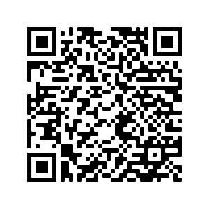

 
<h2 align="center"><b>FruPic-App</b></h2>
<h4 align="center">Android App for <a href="http://frupic.frubar.net">http://frupic.frubar.net</a></h4>
  

    

 
  

  <a href="#description">Description</a> &bull; <a href="#donate">Donate</a> &bull; <a href="#license">License</a>

  <a href="http://www.saschahlusiak.de">Website</a> &bull; <a href="http://www.saschahlusiak.de/category/general/">Blog</a>

## Description

Simple front end to show and download images from <a href="http://frupic.frubar.net">http://frupic.frubar.net</a>.

- Show overview of all images in a grid
- Show full screen version of Frupic
- Get notifications about newly uploaded Frupics
- Upload images directly from gallery or app
- Download and share images.
- Star your favourite Frupics.

## Donate

<table>
  <tr>
    <td></td>
    <td></td>
    <td><samp><a href="https://www.blockchain.com/ltc/address/Lh3YTC7Tv4edEe48kHMbyhgE6BNH22bqBt">Lh3YTC7Tv4edEe48kHMbyhgE6BNH22bqBt</a></samp></td>
  </tr>
  <tr>
    <td></td>
    <td></td>
    <td><samp><a href="https://www.blockchain.com/btc/address/bc1qdgm2zvlc6qzqh8qs44wv8l622tfrhvkjqn0fkl">bc1qdgm2zvlc6qzqh8qs44wv8l622tfrhvkjqn0fkl</a></samp></td>
  </tr>
</table>

## License

FruPic for Android is Free Software: You can use, study share and improve it at your
will. Specifically you can redistribute and/or modify it under the terms of the
[GNU General Public License](https://www.gnu.org/licenses/gpl.html) as
published by the Free Software Foundation, either version 2 of the License, or
(at your option) any later version.

FruPic-App is Copyright (c) by Sascha Hlusiak, 2012-2022.

Email: apps@saschahlusiak.de
GitHub: https://github.com/shlusiak/FruPicApp
